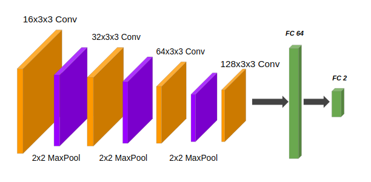

# Interpretable Neural Network
POVID project at FIIT

Author: František Šefčík

## Introduction

In the recent years neural networks furthered the state of the art in many domains like object detection and speech recognition. 
Despite the success neural networks are typically still treated as black boxes. 
In the attempt to understand neural networks better several interpretability techniques were introduces. 
The interpretability and understanding of deep learning models is important, especially in areas such as self-driving cars or medicine, 
where the relevance of the models decisions must be guaranteed.

In this work we introduced a method, how to use several interpretation techniques like, e.g. Saliency, Deconvnet, GuidedBackprop, SmoothGrad, IntergratedGradients, LRP for improvement of neural network prediction. 
We trained network for problem of aggressiveness brain tumor prediction on volumetric MRI data. Segmentations of tumor regions were used to count metrics which describes characteristics of interpretations heatmaps.


## Installation

1. Clone repository
```shell script
git clone git@github.com:vgg-fiit/pv-semestralny-projekt-streda-18-tamajka-FrantisekSefcik.git
```

2. Build docker image
```shell script
cd cd interpretable-nn
docker build -t interpretable-nn/tensorflow:1.15.0-gpu-py3-jupyter .
```

3. Run docker container
```shell script
docker run --gpus all -u $(id -u):$(id -g) --rm -p 8888:8888 -p 6006:6006 -v $(pwd):/project -it --name interpretable-nn-project interpretable-nn/tensorflow:1.15.0-gpu-py3-jupyter
```

All installation dependencies are defined in requirements.txt file.
As a framework for neural networks training will be used [Keras 2.24](https://keras.io/) with [Tensorflow 1.15](https://www.tensorflow.org/) backend. 
To apply multiple interpretation techniques on Keras model, [Innvestigate](https://github.com/albermax/innvestigate) library was used. Also next data mining libraries like, e.g. Numpy, Scikit-learn, PIL, ... were used.


## Dataset
To evaluate and train our method for neural network interpretation we have chosen BraTS dataset.[1] 
Dataset contains of multimodal MRI scans of glioblastoma (GBM/HGG) and lower grade glioma (LGG), with pathologically confirmed diagnosis. 
Data are provided in train, validation and test set, but the ground truth are available only for train data. 
All BraTS multimodal scans are available in multiple clinical protocols as T1 and post-contrast T1-weighted, T2-weighted (T2), and T2 Fluid Attenuated Inversion Recovery (FLAIR) volumes.
For all volumes, segmenated annotations are available. Annotations comprise four tumor regions: the GD-enhancing tumor (label 4), the peritumoral edema (label 2), and the necrotic and non-enhancing tumor core (label 1).  

## Method

In this section we will describe our pipeline where we start with MRI volumes preprocessing, continue with neural network model training and finish with analysis of interpretation techniques and proposed method for trained model. 

### Data preprocessing

In the preprocessing phase we used three MRI protocols (T1ce, T2, FLAIR) to create RGB slices of tumor. From original volumes we extracted only slices where tumor occurred. We found position of tumor from ground truth segmentation mask. 
To select only slices with tumor we firstly found middle slice from slices where tumor is occurred. Then we selected defined number of slices in neighbourhood of middle slice.


Then we combined slices from each MRI modality to RGB image, which was saved with competent slice of tumor segmentation. In the next image you can see result from combination of above displayed slices. On the right side, tumors segmentation slice is showed.
With this process we create train, validation and test slices from all LGG and HGG images. Also we applied normalization to each image.


Code available here: [Image preprocessing jupyter notebook](https://github.com/vgg-fiit/pv-semestralny-projekt-streda-18-tamajka-FrantisekSefcik/blob/master/interpretable-nn/notebooks/preprocessing_3%20(LGG%20vs%20HGG).ipynb)

### Neural network model

As a next step we trained model of convolutional neural network with preprocessed slices from previous step. We designed and trained network for classification of LGG and HGG tumors.

In the picture bellow you can see architecture of network, where we used 2D convolution layers with ReLu activation function followed by Max pooling layers. 
We also used some regularization techniques like Dropout or BatchNormalization layer. 



Then we trained our network in standard way to obtain best results on validation and test samples. 
For reason we had only about 1600 samples in train data, we apply several augmentation techniques like e.g rotation and horizontal/vertical flip to enrich dataset. Training iterations can be seen in the picture bellow.


Code available here: [Lgg Hgg classification jupyter notebook](https://github.com/vgg-fiit/pv-semestralny-projekt-streda-18-tamajka-FrantisekSefcik/blob/master/interpretable-nn/notebooks/classification_4_lgg_vs_hgg.ipynb)

### Interpretation method

In this section we will describe proposed method to evaluate precision of interpretations techniques.
We will analyze our trained Lgg vs. Hgg neural network model with multiple interpretations methods and our proposed metrics will by used to describe confidence of model prediction.
After we count confidence which says if prediction appears like to be true or false, we will realize small experiment to show how can our method helps to improve prediction.


#### Interpretation techniques

In the last decade, several successful methods for neural networks interpretations were invented. 
We will use Innvestigate [2] toolkit which offer several of popular interpretation techniques like e.g. Gradient, Deconvnet, GuidedBackprop, SmoothGrad, IntergratedGradients, LRP and more, in easy way to apply for Keras models.
In the picture bellow you can see these techniques applied to the several samples of brain tumors. 

In the next steps for simplicity only LRP-Epsilon method will by evaluated.


#### Proposed metrics

To measure how any of interpretation techniques can describe model decisions we proposed own metrics. 
This metrics use segmentation mask of tumor, where it tries to describe how networks focus on region of tumor in a brain. 
That means we count normalized sum of activations inside of tumor in respect to whole brain. Score can be expressed as:

  **valueTumor = sumOfTumorActivations / tumorArea**

  **valueBrain = sumOfBrainActivations / tumorBrain**

  **score = valueTumor / (valueTumor + valueBrain)**
  

In the following image you can see inputs which are necessary for count score from left: report with (ground truth label, prediction, probability and our metric score), next is original picture of brain, segmentation of tumor and last is saliency map of interpretation method.


#### Analysis cross tumor regions

As we know each tumor segmentation can by divided into three levels, which can by named as (region 1. region 2, region 4, total region - all regions together).
We will take a look on each region individually and metrics score will by calculated. In the picture is the same visualization for interpretation as above, 
but we enriched each line with barplot, which shows metrics score cross each tumor region.


#### Quantitative analysis

As we can see in the above image, we are able to describe one prediction with interpretation score cross all tumor regions. Lets quantitatively evaluate our proposed score 
for predicted group of confusion matrix (TP, TN, FN, FP). We are interested in this groups, because we are looking for differences which could distinguish if prediction is true or false.

##### All regions 

In the following images are shown graphs with metrics score distribution for each group cross all regions. Also model performance is available for validation data as classification report with confusion matrix.

From the graphs we can see that for each region some differences in medians and variations are present. These differences can by helpful for prediction of one of groups. 
Some more significant differences in data distributions are present in region 4 for groups TN and FP. 
It can indicate that scores for negative class are significantly smaller than positive class, which means that if prediction is positive but score is small in region 4, prediction is probably false.
    


##### Region 1


##### Region 2


##### Region 4


### Confidence of prediction

In the last step we take a look how to take advantages of interpretation to predict confidence of prediction, which  can be useful for user of system.

#### Analysis of score metrics

We analyzed some relations between metrics scores for all tumor regions and prediction probability. We used pairplot which shows scatterplot for each pair of attributes.


The most differences we can in the prediction probability attribute, where most of samples from TP class has almost 100% probability of prediction. 
This could be accurate atribute to determine TP class.


We can take next look from correlation heatmap, where is largest correlation between total region and rest of regions, it is for reason that each region is subpart of total region. 
But where where we can interesting correlation are between region 1 and region 4. Also high negative  correlation is present between probability and total region. 


#### KNN to predict confidence

We trained KNN classifier which would by possible to distinguish if prediction is true or false. We created dataset from above 
visualised attributes (score_reg1, score_reg2, score_reg4, score_regt, prob) from validation data. We added one more attribute: prediction of model, 
because if we add prediction then KNN will by possible to predict only two from four classes like:

* 1: TP- true prediction, FP- false prediction
* 0: TN- true prediction, FN- false prediction

For example if model predicted 1, then our KNN model will predict only TP and FP. In the picture bellow some cases are displayed, where histogram on the right site shows confidence for prediction.
In the first case prediction is 100% confident and in the third case prediction is on 75% not confident.


#### KNN evaluation on experiment

We propose experiment where we try correction of model prediction with our KNN method. 
For evaluation we used test data which ether network model or KNN model does not know yet.

In the first step we evaluate performance of model on test data and performance report can be seen in the following picture.


In the second step we took prediction and correct this prediction with our method of KNN by following rules: if confidence of prediction is predicted with KNN as false then predicted class is swapped.
E.g. model predict 0 and KNN predict as FN then 0 is swapped to 1.

In the bellow picture is the same report for corrected prediction, where we can see significant improvement. We can see that our adjusted prediciton boosted performance. 
Accuracy is higher about 10%, but also other metrics show improvement. Number of corrected samples are visible in the confusion matrices.


Code available here: [Interpretation notebook](https://github.com/vgg-fiit/pv-semestralny-projekt-streda-18-tamajka-FrantisekSefcik/blob/master/interpretable-nn/notebooks/interpretation_4_lgg_vs_hgg.ipynb)


## Conclusion

In this work we introduced approach how to take advantages from interpretation techniques to correct prediction 
of neural network model for medical problem of classification of tumor aggressiveness. In the future work we suggest to obtain new statistics observation for 
interpretations and use this observation for improvement of confidence identification. 

## Github

Link to github repo: [https://github.com/vgg-fiit/pv-semestralny-projekt-streda-18-tamajka-FrantisekSefcik](https://github.com/vgg-fiit/pv-semestralny-projekt-streda-18-tamajka-FrantisekSefcik)

## References
[1] B. H. Menze, A. Jakab, S. Bauer, J. Kalpathy-Cramer, K. Farahani, J. Kirby, et al. "The Multimodal Brain Tumor Image Segmentation Benchmark (BRATS)", IEEE Transactions on Medical Imaging 34(10), 1993-2024 (2015) DOI: 10.1109/TMI.2014.2377694

[2] https://github.com/albermax/innvestigate